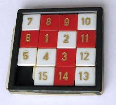

# 8 puzzle Problem using Branch And Bound / Problema de Rompecabezas 8 usando Ramificación y Acotamiento

## Problem
Given a 3×3 board with 8 tiles (every tile has one number from 1 to 8) and one empty space. The objective is to place the numbers on tiles to match final configuration using the empty space. We can slide four adjacent (left, right, above and below) tiles into the empty space.

## Problema
Dado un tablero de 3x3 con 8 losas (cada losa tiene un número del 1 al 8) y un espacio vacío. El objetivo es poner los números de las losas concuerden con la configuración final usando el espacio vacío. Podemos deslizar cuatro adyacentes (izquierda, derecha, arriba y abajo) losas en el espacio vacío.

## Branch and Bound Algorithm
The search for an answer node can often be speeded by using an “intelligent” ranking function, also called an approximate cost function to avoid searching in sub-trees that do not contain an answer node. It is similar to the backtracking technique but uses BFS-like search.

## Algoritmo Ramificación y Acotamiento
La búsqueda para un nodo respuesta puede a veces ser rápida usando una función de clasificación "inteligente", también llamada una función de costo aproximado para evitar búsqueda en sub-árboles que no contienen un nodo respuesta. Es similar a la técnica de retroceso, pero usando búsqueda tipo-BFS.

## My motivations
The search for algorithms to solve this problem comes from my days at the University, I tried to do a search for "brute force" today I know that it is an uninformed search, and that there are billions of possibilities, at that time I felt Stark (Father) saying that the computer ran out of memory and that in the future I could find the solution since it was limited by the technology of my time (ha).

I also implemented the A* algorithm through heuristic search, however, I realized that there are also cases that cannot be solved (impossible). Impossible, this term seemed strange to me as the name of a final configuration in the plastic game that they sold for children
! [Puzzle 1] (img / puzzle1.png)
However, I soon realized that, if so, impossible, if we removed a couple of pieces from the board and exchanged them that scenario could be solved, but the other scenarios were no longer possible to solve them (spiral, inverted, etc.)

In my search I found a thousand solutions, but few with a definitive one, I found cases that used optimizations to speed up how to obtain a random movement, or diagonal movements, well, that I no longer considered them much, the optimizations if I make good improvements, what I tried was something more attached to reality, I have made cases of up to 21 movements and I have a strong search that would take less than a minute, others, the easy ones, maybe 5 or 10 seconds (computer time of the year 2020).

I found several implementations in different programming languages, c ++, phyton, etc. I just passed it to Java, I hope to do something graphic later.

## Mis motivaciones
La búsqueda de algoritmos para la resolución de este problema viene desde mis días en la Universidad, intenté hacer una búsqueda por "fuerza bruta" hoy se que es una búsqueda no informada, y que hay billones de posibilidades, en ese tiempo me sentí Stark (Padre) diciendo que la computadora se quedaba sin memoria y que en el futuro podría encontrar la solución ya que estaba limitado por la tecnología de mi tiempo (ja). 

También implementé el algoritmo A* mediante búsqueda heurística sin embargo, me di cuenta que también hay casos que no pueden resolverse (imposibles); Imposible, este término se me hacía extraño como nombre de una configuración final en el juego plástico que vendían para niños 

Sin embargo, pronto me di cuenta que, si era así, imposible, si quitábamos un par de piezas del tablero y las intercambiábamos se podía resolver ese escenario, pero los demás escenarios ya no eran posible resolverlos  (espiral, invertido, etc.)

En mi búsqueda me encontré con mil soluciones, pero pocos con una definitiva, encontré casos que usaban optimizaciones para agilizar como obtener un movimiento aleatorio, o movimientos en diagonal, bueno, eso ya no los consideré mucho, las optimizaciones si se me hacen buenas mejoras, lo que intenté fue algo más apegado a la realidad, he hecho casos de hasta 21 movimientos y se me hace una búsqueda fuerte que tardaría menos de un minuto, otras, las fáciles, quizás 5 o 10 segundos (tiempo de computadora del año 2020).

Encontré diversas implementaciones en distintos lenguajes de programación, c++, phyton, etc. yo solo lo pasé a Java, espero hacer algo gráfico posteriormente.

Source/Fuente:
[https://www.geeksforgeeks.org/8-puzzle-problem-using-branch-and-bound/](https://www.geeksforgeeks.org/8-puzzle-problem-using-branch-and-bound/)
